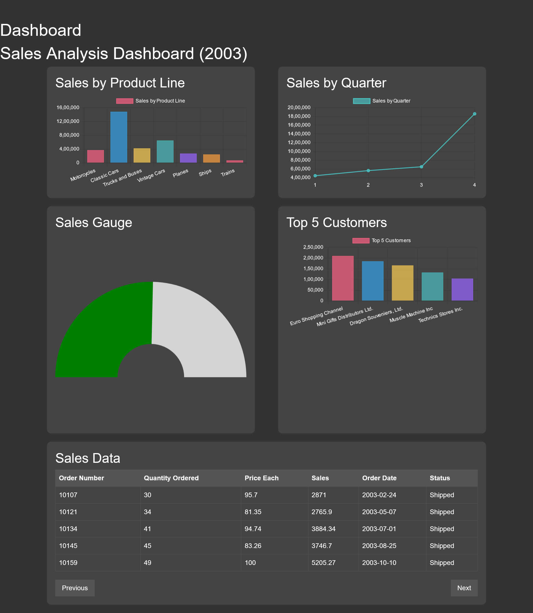

# GenAI Dashboard Generator

This project is a **Flask-based chatbot** that dynamically generates an interactive dashboard based on user queries and a CSV file. It utilizes **Google Generative AI (Gemini)** to process user inputs and generates Chart.js-based HTML code to visualize the data.

---

## Project Structure
```
GenAI-Dashboard-Generator/
├── static/            # Static assets like the CSV file
│   └── data.csv       # Data source for the dashboard
├── templates/         # HTML templates
│   └── index.html     # Home page
│   └── dashboard.html # Dashboard rendering page
├── .gitignore         # Ignored files for Git
├── app.py             # Flask application
├── requirements.txt   # Project dependencies
```

---

## Features
1. **User Input**: Accepts user queries through a form.
2. **Dynamic Dashboard Generation**: Generates interactive dashboards based on CSV data.
3. **Integration with GenAI**: Utilizes **Google Gemini** to generate valid Chart.js HTML code.
4. **Responsive Charts**: Incorporates charts, tables, and gauge components.
5. **Dark Theme**: Ensures better visual appeal with a consistent dark mode.
6. **Beautiful Pagination**: Tables include responsive pagination with left/right buttons.

---

## Prerequisites
- **Python** >= 3.8
- **Google Generative AI API Key**
- **Flask**
- **Pandas**

---

## Installation

1. **Clone the Repository**:
   ```bash
   git clone https://github.com/Ganesh-Thorat-01/GenAI-based-Dashboard-Generator.git
   cd GenAI-based-Dashboard-Generator
   ```

2. **Set Up the Environment**:
   Create a virtual environment and activate it.
   ```bash
   python -m venv venv
   source venv/bin/activate  # For Windows: venv\Scripts\activate
   ```

3. **Install Dependencies**:
   ```bash
   pip install -r requirements.txt
   ```

4. **Add Google Generative AI API Key**:
   - Create a `.env` file in the root directory.
   - Add your API key:
     ```
     GOOGLE_API_KEY=your_api_key_here
     ```

5. **Add Your CSV File**:
   Place your data file in the `static/` folder as `data.csv`.

---

## Running the Application
1. Run the Flask app:
   ```bash
   python app.py
   ```
2. Open your browser and navigate to:
   ```
   http://127.0.0.1:5000/
   ```

---

## Usage
1. **Home Page**:
   - Enter a query describing the type of dashboard you need.
2. **Dashboard Page**:
   - The app processes the query using Google Generative AI.
   - An interactive dashboard is rendered with:
     - **Charts**: Bar, line, pie, gauges, etc.
     - **Tables**: With pagination and responsiveness.

---

## Example Query
**"Create a dashboard to analyze and visualize sales data from the CSV file with all chart types and a table at the bottom."**

**Output**:
An interactive dashboard with:
- Bar charts
- Line charts
- Pie charts
- Gauge charts
- Responsive tables with pagination

---

## Screenshots

### Dashboard Page


---

## Technologies Used
- **Flask**: Web framework
- **Pandas**: Data processing
- **Google Generative AI (Gemini)**: LLM for generating dashboard code
- **Chart.js**: JavaScript library for charts
- **HTML/CSS**: Frontend rendering

---

## Future Improvements
- Add support for multiple CSV files.
- Optimize LLM prompts for faster responses.
- Allow real-time editing of dashboards.
- Add export options (PDF/Excel).

---

## License
This project is licensed under the MIT License.

---

## Contact
For any inquiries, feel free to reach out:
- **Email**: thorat.ganeshscoe@gmail.com
- **GitHub**: [Ganesh-Thorat-01](https://github.com/Ganesh-Thorat-01)
